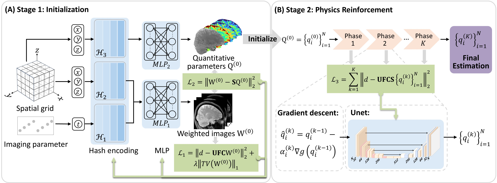

# Accelerating multiparametric quantitative MRI using self-supervised scan-specific implicit neural representation with model reinforcement

- [Introduction](#introduction)
- [Getting Started](#getting-started)
- [Inference](#inference)
- [Contacts](#contacts)

## Introduction
REFINE-MORE (REference-Free Implicit NEural representation with MOdel REinforcement) is a self-supervised scan-specific method for multiparametric quantitative MRI reconstruction, which integrates the implicit neural representation (INR) with MR physics-based model reinforcement. Specifically, REFINE-MORE models the underlying weighted images and multiparametric parameter maps as coordinate-based functions, parameterized by hash encodings and MLPs, providing a compact and memory-efficient representation of the entire four-dimensional (3D + parametric) data. A model reinforcement module further refines these parameter estimates by enforcing data consistency with the measured k-space data, thereby improving reconstruction accuracy and robustness. 



## Getting Started
The hardware and software environment we tested:
- OS: Rocky Linux release 8.10 (Green Obsidian)
- CPU: Intel(R) Xeon(R) Gold 6338 CPU @ 2.00GHz
- GPU: NVIDIA A100 80GB
- CUDA: 12.2
- PyTorch: 1.13.1
- Python: 3.10.16


### Installation
0. Download and Install the appropriate version of NVIDIA driver and CUDA for your GPU.
1. Download and install [Anaconda](https://www.anaconda.com/download) or [Miniconda](https://docs.anaconda.com/miniconda/).
2. Clone this repo and cd to the project path.
```bash
git clone https://github.com/I3Tlab/REFINE-MORE.git
cd REFINE-MORE
```
3. Create and activate the Conda environment:
```bash
conda create --name REFINE_MORE python=3.10.16
conda activate REFINE_MORE
```
4. Install other dependencies
```bash
pip install -r requirements.txt
```
5. Install the PyTorch extension of [tiny-cuda-nn](https://github.com/NVlabs/tiny-cuda-nn)


### Inference
We provided an example fully-sampled k-space data of multiparametric quantitative magnetization transfer imaging, which can be found in [here](https://www.dropbox.com/scl/fo/ejumetyiqh5uzmbvstb3l/AKXk0GVQXMCn4rr37bQF93Y?rlkey=u3pzbx48msl2jwt2yyq38ku27&st=62bihwho&dl=0). 

To run the reconstruction demo, please use the following command:

```bash
python recon_demo.py
```
Reconstruction results are output to the `outputs/` folder as .mat format.


<!--### TODO
[ ] GUI video demo refinement
    [ ] normal speed
    [ ] intermediate result showing
    [ ] optimize layout and button
    [ ] consistency check
[ ] Support generation video demo
[ ] Output options of GUI-->


### Contacts
[Intelligent Imaging Innovation and Translation Lab](https://liulab.mgh.harvard.edu/) [[github]](https://github.com/I3Tlab) at the Athinoula A. Martinos Center of Massachusetts General Hospital and Harvard Medical School
* Ruimin Feng (rfeng3@mgh.harvard.edu)
* Fang Liu (fliu12@mgh.harvard.edu)

149 13th Street, Suite 2301
Charlestown, Massachusetts 02129, USA
